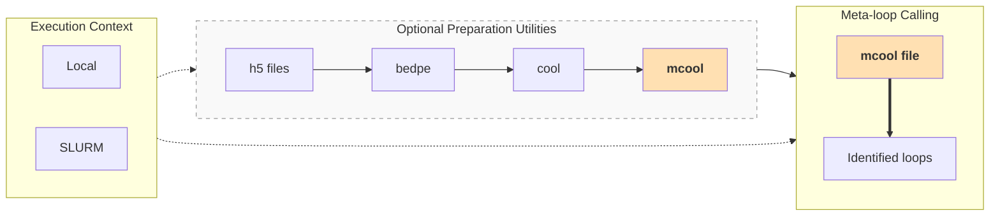

# metaloops-toolkit


This toolkit provides a compatibility layer for running the [Gambetta Lab](https://github.com/gambettalab/meta-loops-2022/tree/main) `meta_loops.R` algorithm. It includes automated workflows for format standardization, multi-resolution .mcool generation, and SLURM HPC integration, with optimized defaults for the Drosophila (dm6) genome.

> **Important:** This repository does **not** implement a new meta-loop calling algorithm.  
> The meta-loop caller included here, `meta_loops.R`, is a copy of the original script from:
> [Gambetta Lab](https://github.com/gambettalab/meta-loops-2022/blob/main/loop_calling/meta_loops.R)
>
> The additional code in this repository consists mainly of:
>
> - Format-conversion helper scripts
> - Local or SLURM HPC config file
> - Drosophila/dm6-oriented defaults


## What this repository does

This repository helps run the following:



The final output of `meta_loops.R` is a tab-separated file with one row per called meta-loop and columns describing both anchors.


## Repository structure

```text
metaloops-toolkit/
├── README.md
├── CHANGELOG.md
├── LICENSE
├── CITATION.cff
├── environment.yml
├── submit.sh
│
├── config/
│   ├── local.env
│   └── dm6.chrom.sizes.txt
│
├── scripts/
│   ├── h5_to_bedpe.py
│   ├── bedpe_to_cool.sh
│   ├── cool_to_mcool.sh
│   ├── h5_to_bedpe_wrapper.sh
│   └── run_metaloops.sh
│
└── third_party/
    └── meta-loops-2022/
        └── meta_loops.R
```


## Installation

Clone this repository:
```bash
git clone https://github.com/ccarloscr/metaloops-toolkit
cd metaloops-toolkit
```

Create and activate the conda environment:
```bash
conda env create -f environment.yml
conda activate metaloops
```

The environment includes the main dependencies needed for the conversion scripts and for running the original `meta_loops.R` script, including Python 3, cooler, h5py, hdf5plugin, numpy, R, and the required R/Bioconductor packages.

Create directories for input files and `results` for the `metaloops.R` output:
```bash
mkdir -p h5_files bedpe_files cool_files mcool_files results
```


## Configuration

This repository uses a local configuration file to avoid hard-coding user-specific paths, genome settings, and HPC/SLURM options inside the scripts.

Edit the configuration file to match your settings:
```bash
nano config/local.env
```

The provided defaults are oriented toward the Drosophila dm6 genome assembly. If you use another genome, you must edit the following parameters with values appropriate for your organism and genome assembly:
```bash
CHROM_SIZES="config/dm6.chrom.sizes.txt"
ASSEMBLY="dm6"
BLACKLIST_CHR="chrM|chrY"
METALOOPS_CHROMOSOMES="chr2L,chr2R,chr3L,chr3R,chr4,chrX"
```
The chromosome sizes file should contain two columns: **chromosome_name** and **chromosome_length**


## Execution

After installation and configuration, the workflow can be run either directly from the command line or submitted to a SLURM-based cluster.

### Local execution

Run the scripts directly using the local configuration file:
```bash
bash scripts/h5_to_bedpe_wrapper.sh config/local.env
bash scripts/bedpe_to_cool.sh config/local.env
bash scripts/cool_to_mcool.sh config/local.env
bash scripts/run_metaloops.sh config/local.env
```

### SLURM execution

SLURM submission templates are provided in the `config/local.env` file. **Before submitting jobs**, check that the SLURM settings in `config/local.env` match your HPC cluster. The `submit.sh` script is a submission wrapper that reads SLURM resource settings from the `config/local.env`. Do **NOT** modify `submit.sh`.

Submit the jobs using the `submit.sh` script and the appropriate `config/local.env` file:
```bash
bash submit.sh scripts/h5_to_bedpe_wrapper.sh config/local.env
bash submit.sh scripts/bedpe_to_cool.sh config/local.env
bash submit.sh scripts/cool_to_mcool.sh config/local.env
bash submit.sh scripts/run_metaloops.sh config/local.env
```

## Notes

- The conversion scripts are helper utilities for preparing Hi-C data for meta-loop calling.
- The actual meta-loop caller is the original `meta_loops.R` script from the Gambetta Lab `meta-loops-2022` repository.
- The provided SLURM options in 'config/local.env' should be customized to match your HPC cluster.
- The default genome settings are for Drosophila dm6.

## Supported HDF5 schema

Different `.h5` Hi-C formats can organize data differently. The current version of the `h5_to_bedpe.py` script supports only sparse CSR Hi-C matrices with the following datasets:
```text
intervals/chr_list
intervals/start_list
intervals/end_list
matrix/data
matrix/indices
matrix/indptr
```

Other HDF5 Hi-C formats may require adapter scripts. If input `.h5` file schema is not supported, an expicit format validation message is raised.


## Credits
This project uses the script [metaloops.sh](https://github.com/ccarloscr/metaloops-toolkit/blob/main/meta_loops.R) developed by Julien Dorier and the Lausanne University, available under license [GNU GPLv3](https://www.gnu.org/licenses/gpl-3.0.html). The original repository can be found in [meta-loops-2022](https://github.com/gambettalab/meta-loops-2022/tree/main).
